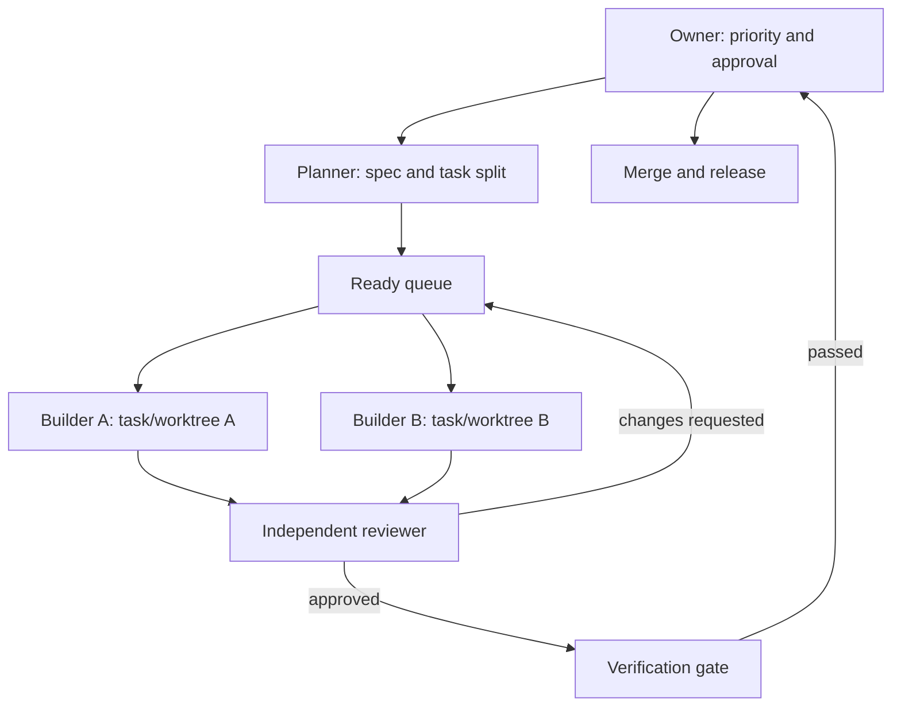
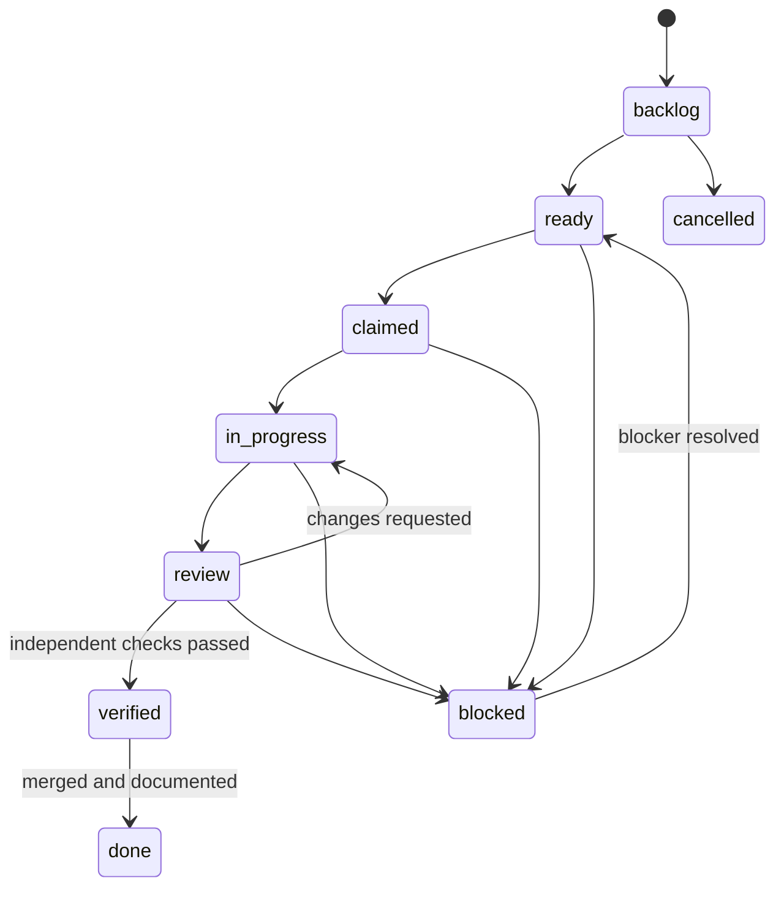
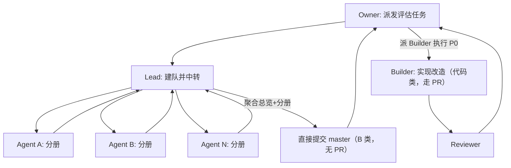

# OPC Agent Operating System

## 1. 设计目标

这套系统只解决五件事：

1. 任何 Agent 在新会话中能在 5 分钟内恢复上下文。
2. 多个 Agent 可以并行工作而不覆盖彼此的文件。
3. 每项工作都有明确的输入、所有者、边界和验收标准。
4. “已完成”必须由测试、审查和 Git 记录共同证明。
5. 你能随时暂停、替换 Agent 或回滚变更，而不丢失项目状态。

不追求 Agent 数量最大化。只有任务真正独立时才并行。

## 2. 三层真相来源

| 层 | 唯一真相 | 存放内容 | 不存放内容 |
|---|---|---|---|
| 产品层 | Obsidian Vault | 项目目标、Spec、任务定义、ADR、审查结论 | 源码副本、聊天全文 |
| 执行层 | 单任务 Markdown 的 YAML 属性 | 状态、认领者、租约、分支、提交、验证结果 | 多任务共享可变日志 |
| 代码层 | Git 仓库和 CI | 代码、测试、提交、PR、发布标签 | 产品决策的唯一副本 |

链接而不是复制。任务链接 Spec、ADR、PR 和 commit；Spec 不粘贴代码；Vault 不保存 Agent 的完整推理过程。

## 3. 最小角色模型

### Owner

由你担任，拥有以下不可委托权限：

- 确定产品优先级和范围。
- 批准不可逆、昂贵或跨系统的架构决策。
- 批准数据库破坏性迁移、权限模型、计费和生产发布。
- 处理 Agent 之间的冲突。

### Planner

- 把需求转为 Spec、ADR 候选和可独立验收的任务。
- 输出任务依赖、边界、验收条件和推荐角色。

### Builder

- 只实现一个已认领的 `ready` 任务。
- 在独立 worktree 和分支工作。
- 提交测试证据和标准化 handoff。

### Reviewer

- 不得与 Builder 是同一个 Agent 会话。
- 从需求、风险、代码和验证四个维度审查。
- 只能给出 `approved`、`changes_requested` 或 `blocked`。

### Verifier

- 对高风险任务独立复跑验证。
- 普通任务可由 Reviewer 兼任。
- 发布前执行跨功能 smoke test。

默认只启用 Planner、Builder、Reviewer。只有安全、支付、数据迁移和发布任务再增加 Verifier。

## 4. 控制拓扑

采用中心化控制，不让 Agent 自由组成常驻团队。



并发条件必须全部满足：

- 任务没有未完成依赖。
- 两个任务不会修改同一个核心文件或同一数据库迁移链。
- 每个任务有不同分支和 worktree。
- 每个任务有唯一所有者和有效租约。
- 集成顺序已在任务中声明。

## 5. Vault 结构

```text
00_Dashboard/       当前项目、待审批、阻塞、今日关注
01_Projects/        项目主页和路线图
02_Specs/           可验收的产品与技术规格
03_Tasks/           每个任务一个文件，执行状态的唯一来源
04_Runs/            每次 Agent 会话一个追加式记录
05_Reviews/         独立审查记录
06_Decisions/       ADR 和重要产品决策
07_Knowledge/       可复用知识，不保存临时任务状态
90_Archive/         已结束项目和失效资料
_templates/         固定模板
```

不要设置独立的 `progress.txt`。进度由任务属性计算，历史由 `04_Runs`、Git 和 Reviews 组成。

## 6. 任务状态机



| 状态 | 进入条件 | 允许修改者 |
|---|---|---|
| `backlog` | 有价值描述但信息可能不完整 | Owner、Planner |
| `ready` | Spec、依赖、验收和风险完整 | Owner、Planner |
| `claimed` | 写入 owner、lease、branch、worktree | 被指派 Builder |
| `in_progress` | 基线检查通过，开始实现 | 被指派 Builder |
| `review` | 提交 handoff、commit、测试证据 | Builder 提交，Reviewer 接管 |
| `verified` | 独立审查通过，必要测试已复跑 | Reviewer、Verifier |
| `done` | 已合并默认分支并更新文档 | Owner 或发布 Agent |
| `blocked` | 明确 blocker、尝试和解除条件 | 当前所有者 |
| `cancelled` | Owner 明确取消并记录原因 | Owner |

禁止从 `in_progress` 直接到 `done`。

## 7. 认领与租约

任务从 `ready` 进入 `claimed` 时必须填写：

- `owner`: Agent 名称或会话 ID。
- `claimed_at`: ISO 8601 时间。
- `lease_until`: 默认 4 小时，长任务最多 24 小时。
- `branch`: `agent/<task-id>-<slug>`。
- `worktree`: 绝对路径。

租约规则：

- 未过期时，其他 Agent 不得修改该任务或对应分支。
- 过期不等于自动抢占。新 Agent 先检查 worktree、Git 状态和 Run。
- 抢占时更新 owner 和 lease，并写一条 takeover Run。
- Agent 每次产生可验证进展后可续租。

## 8. 任务大小

- 一个 Agent 会话内可完成，通常 30 分钟到 4 小时。
- 只产生一个逻辑提交，必要时最多 3 个可独立解释的提交。
- 验收条件可执行，不使用“看起来不错”“优化一下”等主观表达。
- 预计修改不超过 5 到 10 个相关文件；超过时优先拆分。
- 数据迁移、API 合约和 UI 改动尽量拆开并明确顺序。

## 9. 会话启动协议

1. 阅读仓库根目录 `AGENTS.md` 和适用的子目录说明。
2. 阅读项目主页、关联 Spec、ADR 和自己的任务文件。
3. 运行 `scripts/session-check.ps1` 或仓库的等价脚本。
4. 检查 `git status`、最近提交、worktree 和当前分支。
5. 执行快速 smoke test，确认基线没有已知破损。
6. 检查依赖与租约，再把任务改为 `in_progress`。
7. 只做任务范围内的工作。

如果基线已坏，先记录 blocker，不要在坏基线上叠加新功能。

## 10. 会话结束协议

Builder 必须：

1. 运行任务指定的测试、lint、typecheck 或 smoke test。
2. 检查完整 diff，删除调试代码和意外文件。
3. 创建语义清晰的 commit。
4. 填写独立 Run 文件和 handoff。
5. 把任务改为 `review`，不得自己标记 `verified` 或 `done`。
6. 远程可用时推送任务分支并创建 PR。

Reviewer 必须：

1. 从 Spec 和验收条件开始，不只看 diff。
2. 检查行为回归、安全、数据兼容和缺失测试。
3. 至少复跑最高风险的验证命令。
4. 写入独立 Review 文件。
5. 通过后改为 `verified`；否则回到 `in_progress`。

## 11. Git 和 worktree 策略

主工作目录只用于同步、集成和发布，不让 Builder 在其中写代码。

```powershell
git fetch origin
git worktree add -b agent/CC-001-auth-refresh ..\wt-CC-001 origin/master
git worktree list
```

任务完成并合并后：

```powershell
git worktree remove ..\wt-CC-001
git branch -d agent/CC-001-auth-refresh
git worktree prune
```

策略：

- 一个活跃任务对应一个分支和一个 worktree。
- 禁止 Agent 直接 push 默认分支（**此禁令仅适用于代码实现类任务**；评估类 / B 类任务见 §18，允许直接提交默认分支）。
- 默认使用 PR + squash merge，保留一个任务一个主线 commit。
- 默认分支启用 required status checks、禁止 force push 和删除。
- 不同 Agent 会话进行实现和审查，最终仍由 Owner 点击合并。
- 同一数据库迁移目录一次只允许一个 Builder 写入。
- 仓库含 submodule 时先单独验证 worktree 兼容性。

## 12. 风险分级与审批

| 级别 | 示例 | 所需门禁 |
|---|---|---|
| L0 | 文档、注释、无行为格式化 | Builder 验证 |
| L1 | 局部功能、非关键 UI、小型修复 | 独立 Reviewer |
| L2 | API 合约、认证、数据迁移、依赖升级 | ADR/Spec + Reviewer + Verifier |
| L3 | 生产发布、计费、删除数据、权限模型、密钥 | Owner 明确批准 + 回滚方案 |

Agent 不得自行降低风险等级。

## 13. 决策协议

出现以下任一情况必须先写 ADR：

- 新增核心依赖、数据库、队列或外部服务。
- 改变认证、权限、数据保留或隐私策略。
- 修改跨模块 API 或持久化模型。
- 存在两个以上有长期成本的可行方案。

ADR 必须包含 context、options、decision、consequences、rollback。Owner 将 `proposed` 改为 `accepted` 后才允许实现 L2/L3 变更。

## 14. 每周指标

- Lead time: `ready` 到 `done` 的中位时间。
- Rework rate: Review 后退回 `in_progress` 的比例。
- Verification rate: 带可复现证据的完成任务比例，目标 100%。
- Collision count: Agent 文件或分支冲突次数，目标接近 0。
- Stale claims: 租约过期仍未交接的任务数。

不要用 token 数、Agent 数或生成代码行数衡量产出。

## 15. 每日节奏

- 上午 10 分钟：查看待审批、阻塞和 `ready` 队列；最多同时运行 2 到 3 个 Builder。
- 执行阶段：只并行无文件冲突任务；Reviewer 在 Builder handoff 后异步工作。
- 晚间 10 分钟：只合并 `verified`，清理 worktree，由 Owner 处理 blocker 和 ADR。

## 16. 明确不采用

- 不用一个超长 `progress.txt`: 多 Agent 会冲突且难查询。
- 不共享完整聊天历史: 成本高、噪声大、易传播错误假设。
- 不使用常驻“人格团队”: 角色按任务临时实例化。
- 不让 Agent 自行合并和发布。
- 不把 Obsidian 当同文件实时协同编辑器。
- 不复制 GitHub Issues、Obsidian Tasks 和 JSON 三套状态。

## 17. 30 分钟启动

1. 打开 `vault/` 为 Obsidian Vault。
2. 创建一个 Project 和一个 Spec。
3. 拆出 3 到 10 个小任务，先放 `backlog`。
4. 仅把信息完整、无依赖的任务改为 `ready`。
5. 将 `AGENTS.md` 放入代码仓库并填写真实命令。
6. 为第一个任务创建 worktree，指派 Builder。
7. Builder 完成后交给新 Reviewer 会话。
8. Owner 批准合并，把任务从 `verified` 改为 `done`。

## 18. 评估类（B 类）与多 Agent 团队工作流

> 本节于 2026-07-18 由 Owner 在多 Agent 评估实践后补充，当晚据 Owner 决策定稿：**代码实现类任务严格走 branch/PR/merge；评估类（B 类）任务只出 .md、不改码，直接提交默认分支（master），不走 PR。**

### 18.1 两类任务的提交策略（核心定调）

框架区分两类工作，提交策略不同：

| 维度 | 代码实现类任务（Builder） | 评估类任务（B 类 / Evaluator / 专家团） |
|---|---|---|
| 产出物 | 代码改动 + 测试 | 评估文档（.md），不改业务代码 |
| 是否改码 | 是 | 否（只读、只评、只出 .md） |
| 分支 | **必须** `agent/<task-id>-<slug>` + worktree（§7/§11） | 不强制；可直接在主工作目录产出 |
| PR | **必须** 提 PR，禁止直推默认分支（§11） | **不需要**；直接提交默认分支（master） |
| 合并裁决 | Owner 在 PR 中审查后点击合并 | 文档即交付物；Owner 读后决定采纳 / 派 Builder 落地 P0，无合并动作 |
| 风险等级 | L1–L3（§12） | L0（纯文档，§12） |

> 一句话：代码改动能炸，必须有人把关走 PR；评估只出文档、风险为零，直接进 master 即可，不必为流程而流程。

### 18.2 评估类（B 类）任务 = 直接提交默认分支

- Evaluator 在主工作目录或临时 worktree 产出评估文档，**不触碰业务代码**；文档本身风险等级为 L0（纯文档，见 §12）。
- 评估中标记的改造建议（如 P0/P1 缺口）按 §12 风险分级定级；这些建议**不是已完成的变更**，而是待 Owner 拍板后派 Builder（代码类任务，走 §6/§11）实现的候选任务。
- 提交方式：评估文档直接 `git add / commit / push` 默认分支（master），或落 OB（OneDrive，非 git）即可；**不建分支、不提 PR、不要求 Owner 合并**。
- Owner 闭环：阅读评估结论 → 选择：
  - 直接采纳文档（仅作为决策记录）；
  - 将标 P0/P1 的改造建议拆为 `ready` 任务，派 Builder 实现（回到 §6 状态机 + §11 严格 PR）；
  - 退回 Evaluator 补充证据或修正严重度。

### 18.3 多 Agent 团队单元（如架构专家团）

当评估类任务需要多个专业 Agent 并行（例如业务 / 系统 / 安全 / 平台 / 用户故事五位架构师并行评估，由主理人合稿），按"团队单元"而非"多个独立 Builder"处理；**团队单元整体仍属评估类（B 类），直接提交默认分支，不提 PR**：

- 一个团队 = 多个专业 Agent（并行产出分册）+ 一个主理人（Lead）。
- Lead 不是 Builder：负责在 Agent 间中转上下文、合稿、对跨 Agent 分歧做裁决；Lead 不得代写各成员的专业结论。
- 团队可共用一个临时 worktree（可选，非强制）；最终由 Lead 聚合出**一份总览 + N 份分册，直接提交默认分支（master）**，而非每个 Agent 各提一个 PR。
- 控制拓扑：



- 团队内部的分歧（如严重度冲突、方案选择）由 Lead 裁决并写入总览；若涉及跨系统长期成本，按 §13 升为 ADR 交 Owner。

### 18.4 与现有机制的对齐

- **代码实现类任务**：分支与 worktree 策略严格遵循 §11（一个活跃任务一个分支一个 worktree，**禁止 push 默认分支**，PR + squash merge，Owner 最终合并）。评估类任务不适用此禁令，见 18.1/18.2。
- **评估类任务**：不执行 §10 的"推送任务分支并创建 PR"步骤、不填 §7 的 `branch`/`worktree`（填 `n/a` 即可），其余状态机字段照常。
- 任务状态机沿用 §6：评估类任务同样经历 `ready → claimed → in_progress → review → verified → done`；`verified` 由 Owner 在采纳文档或派发改造任务后标记（无 PR 合并环节）。
- 风险门禁沿用 §12：评估文档 L0；其建议的改造按 L1–L3 走对应门禁（且必为代码类任务、走严格 PR），不得由 Agent 自行降级。

